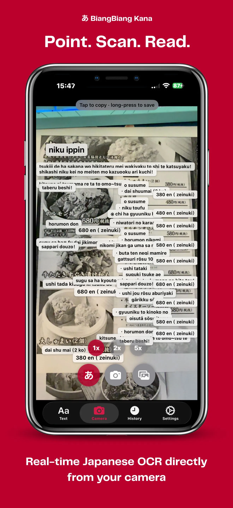

# BiangBiang Kana


## Overview

BiangBiang Kana is an iOS and Android application that converts Japanese text — Kanji, Hiragana and Katakana — into Hepburn romaji, and translates Japanese text into any language. It includes OCR capabilities for recognizing Japanese text from images, either live or from files.

The iOS app is built with Swift and SwiftUI, leveraging Apple's Vision framework for OCR; the Android app is built with Kotlin and Jetpack Compose, using Google ML Kit. Both are thin config layers over the shared [BiangBiangUI](https://github.com/veeso/BiangBiangUI) library.

I developed this app to help myself and others learn Japanese more effectively by providing an easy way to read and pronounce Japanese text. Being able to read the romaji of a sign or a menu out loud makes an unfamiliar language approachable — that is the problem this app aims to solve, aside from being a useful tool for learning Japanese in general.

## Features

- [x] Convert Japanese (Kanji, Hiragana, Katakana) to Hepburn romaji
- [x] Translate Japanese to any language
- [x] OCR support for images (both live and from camera)
- [x] OCR support from files

## Download

You can download BiangBiang Kana from the App Store and from the Google Play Store.

[](https://apps.apple.com/app/id6770998277)
[](https://play.google.com/store/apps/details?id=dev.veeso.biangbiangkana)

## Required Tools

- [`swiftformat`](https://github.com/nicklockwood/SwiftFormat) — required for formatting iOS Swift code. Install via Homebrew:

  ```bash
  brew install swiftformat
  ```

## iOS

Format code using

```bash
swiftformat ./ios
```

Run `swiftformat ./ios` whenever iOS code is modified.

## License

This project is licensed under the Elastic V2 license. See the [LICENSE](./LICENSE) file for details.

## Gallery

Convert Japanese to Romaji and translate.


Recognize Japanese from live images and convert to Romaji.


